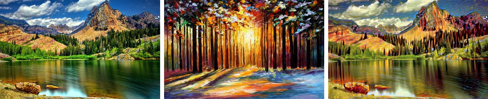
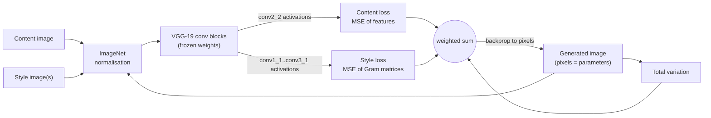

# Neural Style Transfer (PyTorch)

[](https://github.com/houssammehdi/NeuralStyleTransfer-PyTorch/actions/workflows/ci.yml)


Re-paints a photograph in the style of an artwork by optimising the image's pixels so that its deep
VGG-19 features match the *content* of one image and the *style* (feature correlations) of another —
the method of Gatys, Ecker & Bethge, [*Image Style Transfer Using Convolutional Neural
Networks*](https://openaccess.thecvf.com/content_cvpr_2016/papers/Gatys_Image_Style_Transfer_CVPR_2016_paper.pdf)
(CVPR 2016).

Started in 2019 as a university Project Laboratory (AUT); rewritten in 2026 as a tested,
installable package with a CLI.


<sub>Content photo · style painting · result (L-BFGS, from the original 2019 experiment notebook).</sub>

## Features

- VGG-19 feature extractor, truncated after the deepest layer the loss uses
- Canonical VGG-19 layer names (`conv4_2`, `relu3_1`, `pool2`, …); defaults: content `conv2_2`,
  style `conv1_1…conv3_1` (the PyTorch tutorial's choice), all configurable
- **Multi-style blending** — interpolate between several paintings with `--blend`
- **Colour preservation** — keep the photo's colours (a post-hoc YIQ luminance swap)
- Total-variation regularisation against high-frequency noise
- L-BFGS (fast convergence) or Adam (lower memory, works well on Apple MPS)
- Content or noise initialisation, reproducible seeds, intermediate frame export
- Auto device selection: CUDA → MPS → CPU

## How it works



For a layer with feature map $F \in \mathbb{R}^{C \times HW}$, the style is summarised by the
Gram matrix $G = F F^\top / (CHW)$: which features fire *together*, regardless of *where*.
The generated image $x$ minimises

$$
\mathcal{L}(x) = \alpha \sum_{l \in \text{content}} \operatorname{mean}\big(F_l(x) - F_l(c)\big)^2
             + \beta \sum_{l \in \text{style}} \operatorname{mean}\Big(G_l(x) - \sum_k w_k\, G_l(s_k)\Big)^2
             + \gamma\, \mathrm{TV}(x)
$$

where the means run over all entries (both terms are mean squared errors) and the weights $w_k$
blend multiple style images. Only the pixels of $x$ are optimised; the network is frozen. A feature
extractor returns the activations of every requested layer from one forward pass.

## Quickstart

```bash
pip install torch torchvision            # or the CUDA / MPS build for your machine
pip install -e .

python -m neural_style photo.jpg painting.jpg -o out.jpg --steps 300
```

The first run downloads the ImageNet VGG-19 weights (~550 MB) through torchvision.

More options:

```bash
# blend two styles 70/30 and keep the photo's colours
python -m neural_style photo.jpg starry.jpg scream.jpg --blend 0.7 0.3 --preserve-colors

# higher resolution on a GPU, smoother result, save a frame every 50 steps
python -m neural_style photo.jpg painting.jpg --size 768 --tv-weight 1e-4 --save-every 50

# Adam instead of L-BFGS (lower memory)
python -m neural_style photo.jpg painting.jpg --optimizer adam --lr 0.02 --steps 1000
```

As a library:

```python
import torch
from neural_style import TransferConfig, load_image, load_vgg19, save_image, stylize

device = torch.device("cuda" if torch.cuda.is_available() else "cpu")
content = load_image("photo.jpg", 512, device)  # shorter edge 512 px
style = load_image("painting.jpg", None, device)  # any size and aspect ratio

result = stylize(load_vgg19("torchvision").to(device), content, [style], TransferConfig(steps=300))
save_image(result.image, "out.jpg")  # result.history holds the loss of every step
```

## Tuning notes

| Knob | Effect |
|------|--------|
| `--style-weight` | Higher = stronger brush-strokes, less recognisable content. 1e5–1e7 is the useful range. |
| `--init content` | Starts from the photo: converges faster and keeps structure. `noise` gives wilder results. |
| `--tv-weight` | 1e-5–1e-3 removes speckle; too high looks blurry. |
| `--size` | Style features are scale-dependent: the same painting gives finer strokes at higher resolution. |

## Tests

```bash
pip install -e ".[dev]"
pytest -q
```

The tests use a randomly initialised VGG-19, so they run offline in seconds. They check the
Gram-matrix definition and its translation invariance, style blending, model truncation,
that optimisation reduces the loss for both optimisers, colour preservation, and image I/O.

## Repository layout

```
neural_style/   layers.py · model.py · losses.py · color.py · image.py · transfer.py · cli.py
tests/          fast offline tests
notebooks/      original 2019 notebooks: the PyTorch experiment, and a TensorFlow version
                written while following the deeplearning.ai CNN course exercise
docs/           README images
```

## Acknowledgements

Implementation follows the paper above and the structure of the official
[PyTorch neural-transfer tutorial](https://pytorch.org/tutorials/advanced/neural_style_tutorial.html);
colour preservation follows Gatys et al., *Preserving Color in Neural Artistic Style Transfer* (2016).

## License

MIT
