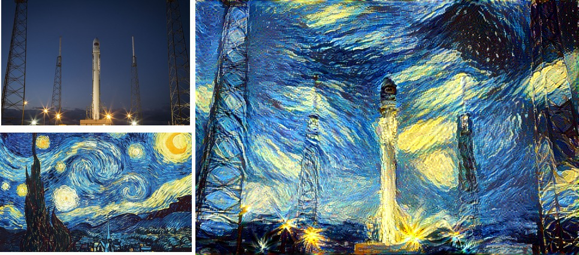
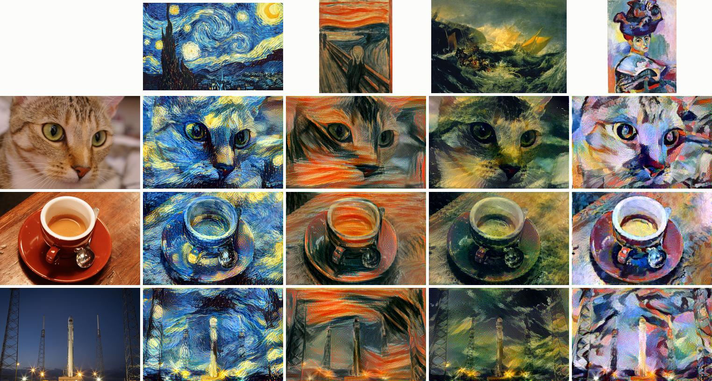
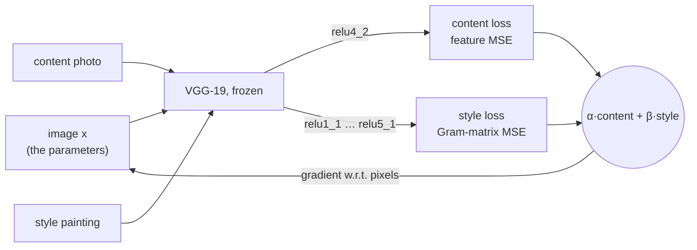

# Neural Style Transfer (PyTorch)

[](https://github.com/houssammehdi/NeuralStyleTransfer-PyTorch/actions/workflows/ci.yml)


A faithful, tested implementation of the neural style transfer methods of Gatys et al.: the
original algorithm (CVPR 2016), colour preservation (2016), and spatial, colour and scale control
(CVPR 2017). It optimises the pixels of an image until its VGG-19 features match the *content* of a
photo and the *style* of a painting, and it runs on a CPU.


<sub>A SpaceX launch photo in the style of Van Gogh's *The Starry Night*, 427 × 640 px, synthesised
coarse-to-fine on a 4-vCPU cloud VM with the original Caffe VGG-19. All inputs are public domain
or CC0 ([credits](docs/gallery/CREDITS.md)).</sub>

## What's inside

- **The weights Gatys et al. used**: the original Caffe VGG-19 of Simonyan & Zisserman, fetched
  from a GitHub release asset, SHA-256 verified and converted to PyTorch, with Caffe
  preprocessing. The conversion is checked against a NumPy cross-correlation and by ImageNet
  classification ([details](docs/method.md#2-the-feature-space-why-vgg-19-and-which-vgg-19)).
  torchvision's ImageNet weights remain the default; if they cannot be downloaded, the error
  message points to `--weights caffe`.
- **The paper's configuration** as the default for those weights: content `relu4_2`, style
  `relu1_1`…`relu5_1`, average pooling, L-BFGS.
- **Spatial control**: `--masks` gives each style its own region (guided Gram matrices).
- **Colour control**: luminance-only transfer, or the painting recoloured to the photo's colour
  statistics first.
- **Scale control**: coarse-to-fine synthesis for larger images, and `--style-scale`.
- Multi-style blending; L-BFGS (optionally with a line search) or Adam; automatic device
  selection (CUDA, Apple MPS, CPU).
- Typed (`mypy --strict`) and tested offline, with property-based tests of the maths.

## Quickstart

```bash
pip install torch torchvision               # or the CUDA / MPS build for your machine
pip install -e ".[caffe]"                   # h5py, to read the Caffe weights
python scripts/fetch_examples.py            # public-domain / CC0 example images

neural-style examples/inputs/chelsea.png examples/inputs/starry_night.jpg \
    --weights caffe --size 256 --steps 200 -o cat.jpg
```

The first `--weights caffe` run downloads 80 MB into `~/.cache/neural-style`. Without
`--weights`, torchvision's weights are used (a 550 MB download from download.pytorch.org).

```bash
# spatial control: Starry Night in the sky, The Scream below (white = where a style applies)
neural-style photo.jpg starry.jpg scream.jpg --masks sky.png ground.png --weights caffe

# keep the photo's colours: luminance-only transfer, or recolour the painting first
neural-style photo.jpg starry.jpg --color luminance --weights caffe
neural-style photo.jpg starry.jpg --color match --weights caffe

# coarse-to-fine: 300 steps at 256 px, then 100 at 512 px
neural-style photo.jpg starry.jpg --size 256 512 --steps 300 100 --weights caffe

# blend two styles, smaller brush strokes, Adam instead of L-BFGS
neural-style photo.jpg starry.jpg scream.jpg --blend 0.7 0.3 --style-scale 0.5 --optimizer adam --lr 0.02
```

`neural-style --help` lists every option.

## Gallery


<sub>Chelsea the cat, a coffee cup and a rocket launch in the styles of Van Gogh, Munch, Turner and
Matisse: 256 px, 200 L-BFGS steps each, Caffe VGG-19, default settings.</sub>

The [gallery](docs/gallery/README.md) also shows spatial control, both colour-preservation
methods, coarse-to-fine synthesis, a style-weight × layer grid and L-BFGS vs Adam convergence
curves, each with the command that made it.

## How it works

For a layer $l$ with feature maps $F_l \in \mathbb{R}^{N_l \times M_l}$ ($N_l$ channels, $M_l$
positions), style is summarised by the Gram matrix $\hat G_l = F_l F_l^\top / (N_l M_l)$: which
features occur *together*, regardless of *where*. The synthesised image $x$ minimises

$$
\mathcal{L}(x) = \alpha \sum_{l \in C} \operatorname{mean}\Big[\big(F_l(x) - F_l(c)\big)^2\Big]
             + \beta \sum_{l \in S} \operatorname{mean}\Big[\Big(\hat G_l(x) - \sum_k w_k\, \hat G_l(s_k)\Big)^2\Big]
             + \gamma\, \mathrm{TV}(x)
$$

over its pixels, with the network frozen; the means run over all entries, and $w_k$ blend several
style images. [`docs/method.md`](docs/method.md)
explains the choices (why Gram matrices, why VGG-19, why L-BFGS), how the normalisation relates
to the papers, the colour, spatial and scale extensions, and every deviation from the papers.



## Pretrained weights

| `--weights` | Source | Input convention | Default layers |
|---|---|---|---|
| `torchvision` (default) | torchvision's ImageNet VGG-19, via download.pytorch.org | RGB, ImageNet mean / std | v0.1: `conv2_2`; `conv1_1`…`conv3_1` |
| `caffe` | Simonyan & Zisserman's Caffe release, Keras conversion on GitHub (80 MB) | BGR, 0–255, mean pixel subtracted | paper: `relu4_2`; `relu1_1`…`relu5_1` |
| `random` | untrained, seeded | — | as torchvision; for smoke tests |

If the torchvision weights cannot be downloaded, the command says so and suggests `--weights caffe`.
The gallery uses the Caffe weights throughout.

## Performance

Measured on a shared 4-vCPU cloud VM (Intel Xeon, 2.8 GHz) with two torch threads while other jobs
were running, so the numbers are indicative; each is recorded with its load average in
[`docs/gallery/`](docs/gallery/) and reproduced by `python scripts/gallery.py speed multiscale`.

| Output size | 128 × 192 | 192 × 288 | 256 × 384 | 384 × 576 | 512 × 767 |
|---|---|---|---|---|---|
| Seconds per L-BFGS step (median of 10, load 2.3–2.7) | 0.25 | 0.59 | 0.95 | 2.4 | 4.3 |

Coarse-to-fine synthesis pays off at larger sizes. At 384 × 576, 200 steps at 192 px plus 50 at
384 px took **238 s**, against 547 s for 200 single-scale steps (load 2.5–3.5). For the same time,
it ends with a 26 % lower loss than single-scale synthesis
([details](docs/method.md#10-scale-control)). No GPU was available, so there are no GPU timings.

## As a library

```python
from neural_style import TransferConfig, load_image, load_vgg19, save_image, stylize

vgg = load_vgg19("caffe")  # or "torchvision"
content = load_image("photo.jpg", 256)  # shorter edge 256 px
style = load_image("painting.jpg")  # any size and aspect ratio

result = stylize(vgg, content, [style], TransferConfig(steps=200, color="luminance"))
save_image(result.image, "out.jpg")
print(result.history[-1])  # loss terms of the last step
```

`stylize_multiscale`, masks (`masks=[...]`), `Objective` (the loss on its own) and the colour
helpers are documented in their docstrings.

## Development

```bash
pip install -e ".[dev,caffe,plots]"
ruff check . && ruff format --check . && mypy && pytest -q
```

The 103 tests run offline on a random VGG-19 and a tiny synthetic weight file, in 20–45 s on the
4-vCPU VM (depending on what else is running).
They check the maths (Gram and guided Gram matrices, mask downsampling, colour transforms, with
property-based tests), the weight converter against a direct NumPy cross-correlation, the
download cache's hash checks, and the optimisation and CLI end to end. `scripts/gallery.py`
regenerates the gallery.

## Where it started

This began in 2019 as a university project laboratory at AUT: the notebooks in
[`notebooks/`](notebooks/) are the original PyTorch experiment (a Colab notebook built on the
official PyTorch tutorial) and a TensorFlow version written while following the deeplearning.ai
CNN course. They are kept unchanged, with their original outputs. Their input images came from
image-hosting links whose authors and licences were never recorded, so none of them is reused
here; everything above is generated from public-domain and CC0 inputs.

## Acknowledgements

The method is that of Leon Gatys, Alexander Ecker, Matthias Bethge, Aaron Hertzmann and Eli
Shechtman (references in [`docs/method.md`](docs/method.md)). The VGG-19 weights are by Karen
Simonyan and Andrew Zisserman, released under CC BY 4.0, in François Chollet's Keras conversion.
Example images: see [credits](docs/gallery/CREDITS.md).

## License

MIT, for the code and the generated images; the inputs keep their own (public-domain / CC0)
status.
