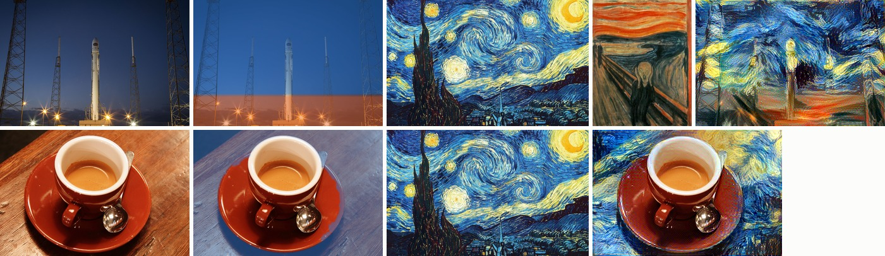
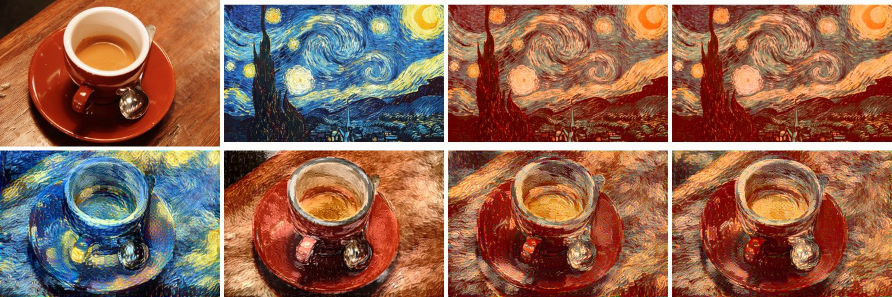
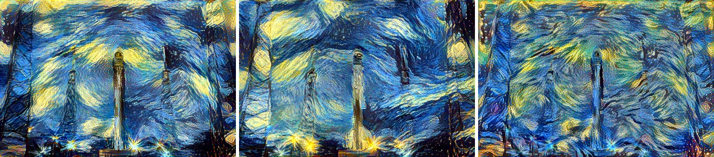
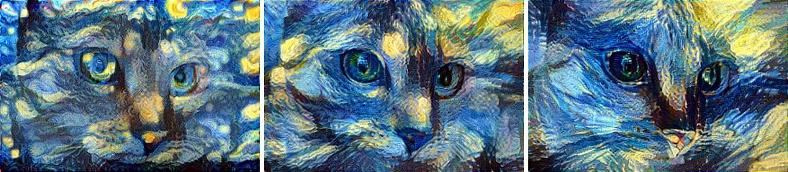
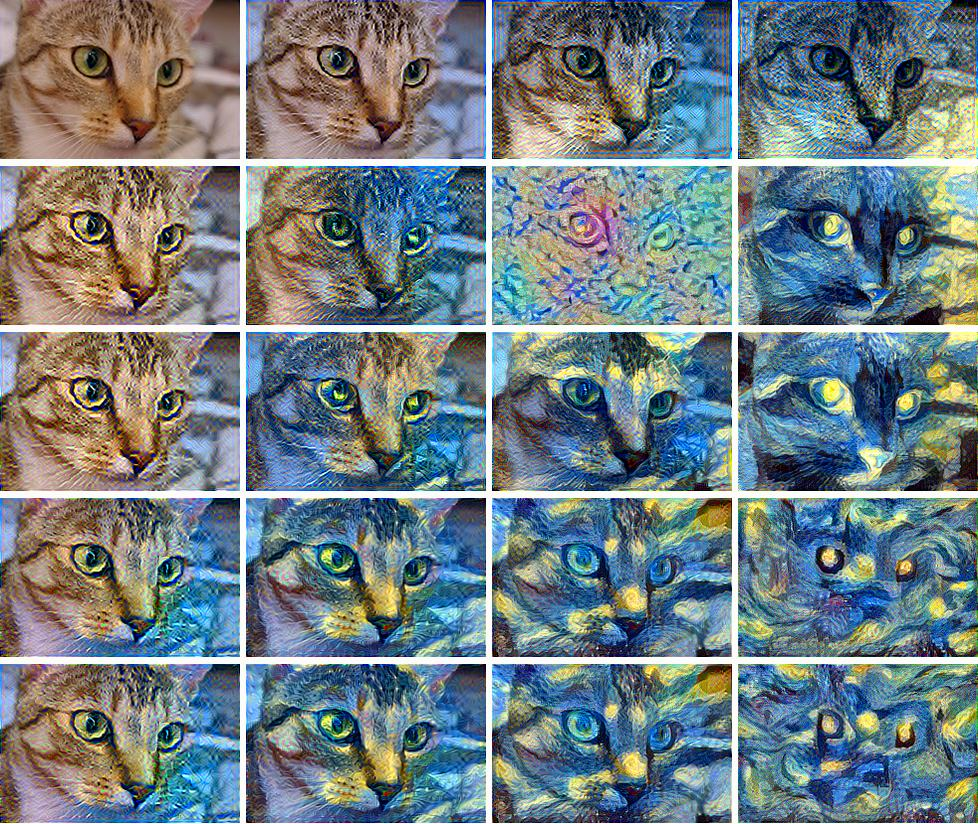
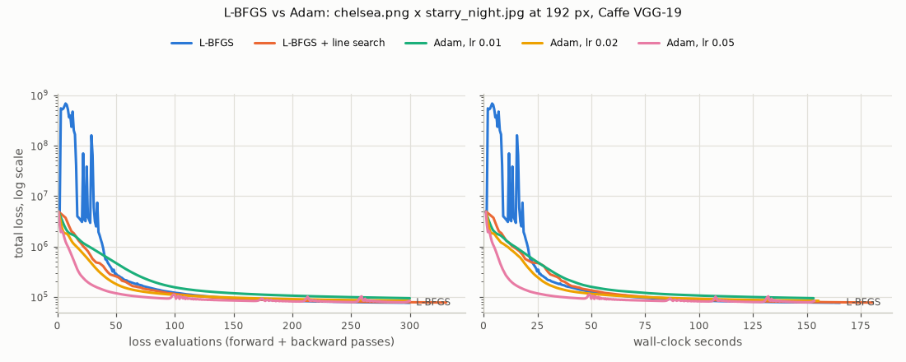

# Gallery

Every image here was produced by this repository on a CPU, with the original Caffe VGG-19 and the
default settings unless stated: content `relu4_2`, style `relu1_1`…`relu5_1`, average pooling,
α = 1, β = 100, L-BFGS started from the photo. All inputs are public domain or CC0; see
[CREDITS.md](CREDITS.md). Each figure has a JSON file next to it with the resolved settings, the
first and last loss values and the wall-clock time of every run.

To reproduce everything (the inputs are downloaded and verified, the weights cached):

```bash
pip install -e ".[caffe,plots]"
python scripts/fetch_examples.py
python scripts/gallery.py styles hero spatial color scale layers --threads 2
python scripts/gallery.py speed convergence multiscale --threads 2
```

Timings were measured on a shared 4-vCPU cloud VM (Intel Xeon at 2.80 GHz) while other CPU-heavy
jobs ran on it, so they are indicative only; the JSON files record the load average next to each.

## Three photographs, four paintings


Rows: Chelsea the cat, a coffee cup, a rocket launch. Columns: Van Gogh's *The Starry Night*,
Munch's *The Scream*, Turner's *The Shipwreck*, Matisse's *Woman with a Hat*. Each result is 256 px
on its shorter edge after 200 L-BFGS steps (`styles.json`).

Each run took between 4.2 and 7.3 minutes (median 6.1) with two torch threads, while other jobs
kept the machine's 1-minute load average between 4 and 10; per-step times measured at a lower load
are in the README's performance table. The grid is saved at JPEG quality 74 to stay under 300 KB.

## Spatial control



Each row: photo, regions (tinted where a style applies), style image(s), result.

Top: the sky (blue) is matched to *The Starry Night* and the launch pad (orange) to *The Scream*,
with guided Gram matrices; the two masks meet in a 12-pixel ramp at 75.5 % of the image height.
The towers and the rocket reach into the sky mask and take its texture. 300 px on the shorter
edge, 200 steps (`spatial.json`).

Bottom: only the table (blue) is stylised. The cup and saucer are outside every mask, so only the
content loss acts on them and they stay photographic. Their mask is a simple colour segmentation
of the red and white porcelain (`porcelain_mask` in `scripts/gallery.py`), which misses part of the
saucer's right rim; that sliver is stylised with the table. 256 px, 200 steps.

The two runs took 7.8 and 9.9 minutes on two threads at a load average of 4 to 10.

## Colour control



Top: the photo, the painting, and the painting recoloured to the photo's colour mean and
covariance with the Image Analogies transform (`--color-match eigen`) and the Cholesky transform
(`--color-match cholesky`). Bottom, the results: plain transfer, luminance-only transfer
(`--color luminance`), and colour histogram matching (`--color match`) with each transform, each
below the painting it used. 256 px, 200 steps each (`color.json`).

Plain transfer repaints the cup in Van Gogh's blues and yellows. Luminance-only transfer keeps the
photo's hues exactly (the cup stays red, the table brown) and carries only the brightness pattern
of the brushwork, which gives flatter colour. Colour matching keeps the photo's palette on average,
but the strokes still vary in colour within it, because the recoloured painting keeps its own
spatial colour structure. The two transforms produce very similar paintings here and nearly
indistinguishable results: both are of the form $\Sigma_c^{1/2} Q\, \Sigma_s^{-1/2}$ and differ
only in the orthogonal $Q$ applied to the whitened colours, which becomes the identity when both
colour distributions are isotropic.

## Coarse-to-fine synthesis



Left to right: single-scale at 384 px (200 steps), coarse-to-fine (200 steps at 192 px, then 50 at
384 px), and single-scale given the same time as coarse-to-fine (87 steps). Two repeats each, two
threads, load average 2.5–3.5 (`multiscale.json`):

| Run (rocket × *The Starry Night*, final size 384 × 576) | Wall-clock (median of 2) | Final loss at 384 px |
|---|---|---|
| single-scale, 200 steps | 547 s | 7.61 × 10⁴ |
| coarse-to-fine, 200 steps at 192 px + 50 at 384 px | 238 s | 8.16 × 10⁴ |
| single-scale, 87 steps (the same time as coarse-to-fine) | 230 s | 1.11 × 10⁵ |

Coarse-to-fine reaches a 26 % lower loss than single-scale synthesis in the same time, and its
swirls are larger: they were laid down at 192 px, where the network's receptive fields cover a
larger share of the image. The README image was made the same way at the photo's native
427 × 640 px: 300 steps at 214 px, then 100 at 427 px (`hero.json`).

## Style scale



`--style-scale 0.5`, `1` and `2`: the painting is resized to a quarter, the same and four times
the photo's pixel count before its statistics are taken, so the same brush strokes cover fewer or
more pixels. 192 px, 200 steps each (`style-scale.json`).

At 0.5 whole motifs of the painting (stars, small swirls) fit into the network's receptive fields
and come back as small, repeated bright blobs; at 2 the receptive fields see only parts of single
strokes, and the brushwork becomes longer and broader while more of the cat survives.

## Style weight and style layers



Modelled on the figure in which Gatys et al. vary the style layers against the content/style
ratio. Rows: the style is matched on `relu1_1` only, then up to
`relu2_1`, `relu3_1`, `relu4_1` and `relu5_1`. Columns: β = 1, 10, 100, 1000 (α = 1). 160 px,
100 steps each (`layers.json`).

Going down the rows, the style is represented at larger scales: with `relu1_1` alone only colours
and the finest grain change, and the swirls and yellow star-like blobs of the painting appear only
once `relu4_1` and `relu5_1` are included. Going right, the style takes over: at β = 1 the photo
is barely touched, at β = 100 (the default) it is strongly stylised but the cat is intact, and at
β = 1000 with all five layers it has largely dissolved into the painting.

One cell is an optimisation failure, not an effect of the settings: `relu2_1` at β = 100 ends
with a higher loss (1.6 × 10⁵) than the same row at β = 1000 (5.7 × 10⁴). Plain L-BFGS overshot
in its first steps (see below) and had not recovered after 100 steps. `--line-search` prevents
this; the grid is shown as it came out. Each run took 27–44 s (`layers.json`).

## L-BFGS versus Adam

<picture>
  <source media="(prefers-color-scheme: dark)" srcset="convergence-dark.png">
  
</picture>

Chelsea × *The Starry Night* at 192 px, all from the photo with the same loss, about 300 loss
evaluations each (the line-search run: 150 steps, 331 evaluations), two threads
(`convergence.json`; the results are in `convergence-results.jpg`). Adam with learning rate 0.05
descends fastest for the first hundred evaluations. Plain L-BFGS first overshoots, to 6.8 × 10⁸
from a start of 4.9 × 10⁶, oscillates for about 40 evaluations, and then reaches the lowest final
loss: 7.6 × 10⁴, against 8.3 × 10⁴ for the best Adam run. With the line search L-BFGS never
overshoots and ends at 7.7 × 10⁴. The table and discussion are in
[`docs/method.md`](../method.md#6-optimisation-why-l-bfgs).
